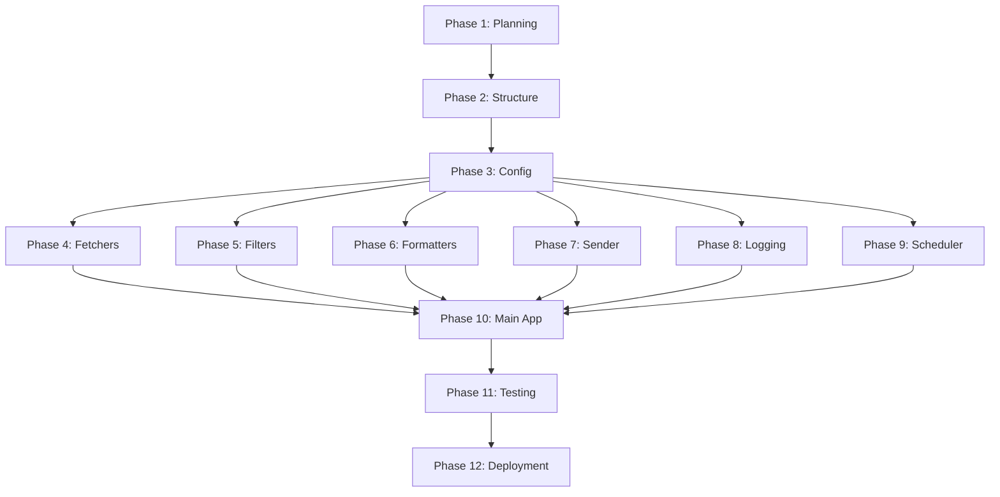

# AI News Agent - Implementation Roadmap

## Overview

This roadmap provides a step-by-step guide for implementing the AI News Agent, with clear milestones, dependencies, and success criteria for each phase.

## Implementation Phases

### Phase 1: Foundation Setup ✅ COMPLETED
**Duration**: 2-3 hours  
**Status**: ✅ Complete

#### Deliverables
- [x] Project planning document
- [x] System architecture design
- [x] Technical specifications
- [x] Setup and installation guide
- [x] Project summary

#### Success Criteria
- ✅ Clear understanding of requirements
- ✅ Well-defined architecture
- ✅ Comprehensive documentation
- ✅ Ready for implementation

---

### Phase 2: Project Structure & Dependencies
**Duration**: 1 hour  
**Status**: 🔄 Next Up

#### Tasks
1. Create project directory structure
2. Set up Python virtual environment
3. Create requirements.txt with all dependencies
4. Create .env.example template
5. Set up .gitignore
6. Initialize git repository (optional)

#### Files to Create
```
ai-news-agent/
├── src/
│   ├── __init__.py
│   ├── fetchers/
│   │   └── __init__.py
│   ├── filters/
│   │   └── __init__.py
│   ├── formatters/
│   │   ├── __init__.py
│   │   └── templates/
│   ├── sender/
│   │   └── __init__.py
│   └── scheduler/
│       └── __init__.py
├── tests/
│   └── __init__.py
├── logs/
├── cache/
├── requirements.txt
├── .env.example
├── .gitignore
└── README.md
```

#### Success Criteria
- [ ] All directories created
- [ ] Virtual environment activated
- [ ] Dependencies installed successfully
- [ ] No import errors

#### Dependencies
```txt
feedparser==6.0.10
requests==2.31.0
beautifulsoup4==4.12.2
python-dotenv==1.0.0
APScheduler==3.10.4
Jinja2==3.1.2
pytz==2023.3
lxml==4.9.3
html2text==2020.1.16
pytest==7.4.3
```

---

### Phase 3: Configuration Management
**Duration**: 1 hour  
**Status**: ⏳ Pending

#### Tasks
1. Implement ConfigManager class
2. Create configuration data classes
3. Add environment variable loading
4. Implement validation logic
5. Create configuration tests

#### Files to Create
- `src/config.py` - Main configuration manager
- `src/models.py` - Configuration data classes
- `tests/test_config.py` - Configuration tests

#### Success Criteria
- [ ] Config loads from .env file
- [ ] All required fields validated
- [ ] Default values work correctly
- [ ] Tests pass

#### Code Snippet
```python
@dataclass
class EmailConfig:
    gmail_user: str
    gmail_app_password: str
    recipient_email: str
    
class ConfigManager:
    def __init__(self, env_path: str = '.env'):
        load_dotenv(env_path)
        self.email = self._load_email_config()
        # ... more configs
```

---

### Phase 4: News Fetching Module
**Duration**: 2-3 hours  
**Status**: ⏳ Pending

#### Tasks
1. Create BaseFetcher abstract class
2. Implement RSSFetcher for news sites
3. Implement ArXivFetcher for research papers
4. Create source configuration
5. Add error handling and retries
6. Write fetcher tests

#### Files to Create
- `src/fetchers/base_fetcher.py` - Abstract base class
- `src/fetchers/rss_fetcher.py` - RSS implementation
- `src/fetchers/arxiv_fetcher.py` - ArXiv implementation
- `src/fetchers/sources.py` - Source configurations
- `tests/test_fetchers.py` - Fetcher tests

#### Success Criteria
- [ ] Can fetch from all 4 sources
- [ ] Articles have standardized schema
- [ ] Error handling works correctly
- [ ] Tests pass for each fetcher

#### Article Schema
```python
{
    'title': str,
    'url': str,
    'source': str,
    'published_date': datetime,
    'summary': str,
    'content': str,
    'author': str,
    'categories': List[str]
}
```

---

### Phase 5: Content Filtering System
**Duration**: 1-2 hours  
**Status**: ⏳ Pending

#### Tasks
1. Implement KeywordFilter class
2. Define keyword lists (primary, secondary, exclusion)
3. Create relevance scoring algorithm
4. Add filtering and sorting logic
5. Write filter tests

#### Files to Create
- `src/filters/keyword_filter.py` - Keyword-based filtering
- `src/filters/ai_filter.py` - Optional AI filtering (future)
- `tests/test_filters.py` - Filter tests

#### Success Criteria
- [ ] Relevance scores calculated correctly
- [ ] Articles filtered by minimum score
- [ ] Articles sorted by relevance
- [ ] Tests pass

#### Scoring Logic
```
Title match (primary keyword): +3 points
Title match (secondary keyword): +2 points
Summary match (primary): +2 points
Summary match (secondary): +1 point
Multiple matches: +1 per additional
Exclusion keyword: -5 points
```

---

### Phase 6: Email Formatting Module
**Duration**: 2 hours  
**Status**: ⏳ Pending

#### Tasks
1. Create HTML email template
2. Implement EmailFormatter class
3. Add article categorization logic
4. Create plain text fallback
5. Test email rendering

#### Files to Create
- `src/formatters/email_formatter.py` - Formatter class
- `src/formatters/templates/digest.html` - HTML template
- `tests/test_formatter.py` - Formatter tests

#### Success Criteria
- [ ] HTML email renders correctly
- [ ] Articles categorized properly
- [ ] Plain text version generated
- [ ] Responsive design works

#### Email Sections
1. Header with date
2. Summary (article count)
3. Top Stories (highest scored)
4. LLM & Language Models
5. Research Papers (ArXiv)
6. Industry News
7. Footer

---

### Phase 7: Gmail SMTP Integration
**Duration**: 1 hour  
**Status**: ⏳ Pending

#### Tasks
1. Implement GmailSender class
2. Add SMTP connection logic
3. Create email sending function
4. Add connection testing
5. Write sender tests

#### Files to Create
- `src/sender/gmail_sender.py` - Gmail SMTP client
- `tests/test_sender.py` - Sender tests
- `test_smtp.py` - Standalone SMTP test

#### Success Criteria
- [ ] SMTP connection successful
- [ ] Test email sent and received
- [ ] Error handling works
- [ ] Tests pass

#### SMTP Configuration
```python
SMTP_SERVER = 'smtp.gmail.com'
SMTP_PORT = 587
Use TLS encryption
Authenticate with App Password
```

---

### Phase 8: Logging System
**Duration**: 1 hour  
**Status**: ⏳ Pending

#### Tasks
1. Create LoggerSetup class
2. Configure file and console handlers
3. Set up log rotation
4. Add structured logging format
5. Test logging

#### Files to Create
- `src/logger_setup.py` - Logger configuration
- `logs/` directory - Log files

#### Success Criteria
- [ ] Logs written to files
- [ ] Console output works
- [ ] Log rotation configured
- [ ] Structured format applied

#### Log Levels
- DEBUG: Detailed information
- INFO: General information
- WARNING: Warning messages
- ERROR: Error messages
- CRITICAL: Critical failures

---

### Phase 9: Job Scheduling
**Duration**: 1 hour  
**Status**: ⏳ Pending

#### Tasks
1. Implement JobScheduler class
2. Add APScheduler integration
3. Create cron job template
4. Add timezone handling
5. Test scheduling

#### Files to Create
- `src/scheduler/job_scheduler.py` - Scheduler wrapper
- `cron_template.txt` - Cron job example

#### Success Criteria
- [ ] APScheduler runs at correct time
- [ ] Timezone handling works
- [ ] Cron template provided
- [ ] Tests pass

#### Scheduling Options
1. APScheduler (built-in)
2. System cron (production)
3. launchd (macOS alternative)

---

### Phase 10: Main Application
**Duration**: 1 hour  
**Status**: ⏳ Pending

#### Tasks
1. Create main.py entry point
2. Implement run_digest_job function
3. Add command-line arguments
4. Integrate all components
5. Add error notifications

#### Files to Create
- `main.py` - Application entry point
- `README.md` - Project documentation

#### Success Criteria
- [ ] --test mode works (preview)
- [ ] --once mode works (single run)
- [ ] Default mode works (scheduler)
- [ ] All components integrated

#### Command-Line Interface
```bash
python main.py          # Run scheduler
python main.py --test   # Preview mode
python main.py --once   # Single run
```

---

### Phase 11: Testing & Quality Assurance
**Duration**: 2-3 hours  
**Status**: ⏳ Pending

#### Tasks
1. Write unit tests for all modules
2. Create integration tests
3. Test end-to-end workflow
4. Fix bugs and issues
5. Code review and refactoring

#### Test Coverage Goals
- Fetchers: 90%+
- Filters: 90%+
- Formatters: 85%+
- Sender: 85%+
- Overall: 85%+

#### Success Criteria
- [ ] All unit tests pass
- [ ] Integration tests pass
- [ ] End-to-end test successful
- [ ] Code coverage > 85%

#### Testing Commands
```bash
pytest tests/
pytest --cov=src tests/
pytest -v tests/
```

---

### Phase 12: Deployment & Documentation
**Duration**: 1-2 hours  
**Status**: ⏳ Pending

#### Tasks
1. Create comprehensive README
2. Write API documentation
3. Set up production environment
4. Configure scheduling (cron/APScheduler)
5. Monitor first few runs

#### Files to Create
- `README.md` - Main documentation
- `API_REFERENCE.md` - Code documentation
- `CHANGELOG.md` - Version history

#### Success Criteria
- [ ] README complete and clear
- [ ] Production environment set up
- [ ] Scheduling configured
- [ ] First email received successfully

#### Deployment Steps
1. Set up virtual environment
2. Install dependencies
3. Configure .env file
4. Test with --test flag
5. Run once with --once flag
6. Set up scheduling
7. Monitor logs

---

## Progress Tracking

### Overall Progress
```
Phase 1: ████████████████████ 100% ✅
Phase 2: ░░░░░░░░░░░░░░░░░░░░   0% 🔄
Phase 3: ░░░░░░░░░░░░░░░░░░░░   0% ⏳
Phase 4: ░░░░░░░░░░░░░░░░░░░░   0% ⏳
Phase 5: ░░░░░░░░░░░░░░░░░░░░   0% ⏳
Phase 6: ░░░░░░░░░░░░░░░░░░░░   0% ⏳
Phase 7: ░░░░░░░░░░░░░░░░░░░░   0% ⏳
Phase 8: ░░░░░░░░░░░░░░░░░░░░   0% ⏳
Phase 9: ░░░░░░░░░░░░░░░░░░░░   0% ⏳
Phase 10: ░░░░░░░░░░░░░░░░░░░░   0% ⏳
Phase 11: ░░░░░░░░░░░░░░░░░░░░   0% ⏳
Phase 12: ░░░░░░░░░░░░░░░░░░░░   0% ⏳

Total: ██░░░░░░░░░░░░░░░░░░ 8%
```

### Time Estimates
- **Completed**: 2-3 hours (Planning)
- **Remaining**: 11-15 hours (Implementation)
- **Total**: 13-18 hours

### Current Status
- **Phase**: Foundation Setup ✅
- **Next**: Project Structure & Dependencies
- **Blockers**: None
- **Ready for**: Code Mode

---

## Dependencies Between Phases



## Risk Assessment

### High Priority Risks
1. **Gmail SMTP Authentication**
   - Risk: App Password setup issues
   - Mitigation: Detailed setup guide, test script

2. **RSS Feed Changes**
   - Risk: Feed URLs or formats change
   - Mitigation: Error handling, multiple sources

3. **Scheduling Reliability**
   - Risk: Cron job fails silently
   - Mitigation: Logging, error notifications

### Medium Priority Risks
1. **Content Filtering Accuracy**
   - Risk: Irrelevant articles included
   - Mitigation: Tunable scoring, user feedback

2. **Email Deliverability**
   - Risk: Emails marked as spam
   - Mitigation: Proper headers, plain text fallback

### Low Priority Risks
1. **Performance Issues**
   - Risk: Slow execution
   - Mitigation: Caching, concurrent fetching

2. **Dependency Updates**
   - Risk: Breaking changes
   - Mitigation: Version pinning, testing

---

## Next Steps

### Immediate Actions
1. ✅ Review planning documents
2. 🔄 Switch to Code mode
3. ⏳ Begin Phase 2: Project Structure
4. ⏳ Set up development environment

### Questions to Consider
- Are you satisfied with the current plan?
- Would you like to modify any features?
- Should we proceed with implementation?
- Any concerns or questions?

---

## Success Metrics

### Technical Metrics
- [ ] All phases completed
- [ ] All tests passing
- [ ] Code coverage > 85%
- [ ] Zero critical bugs

### User Metrics
- [ ] Email received daily at 8 AM IST
- [ ] Average relevance score > 4/5
- [ ] Setup time < 30 minutes
- [ ] User satisfaction high

### Operational Metrics
- [ ] 99%+ delivery rate
- [ ] < 1 minute execution time
- [ ] < 1 error per week
- [ ] Minimal maintenance required

---

**Ready to proceed with implementation?** Switch to Code mode to begin Phase 2! 🚀