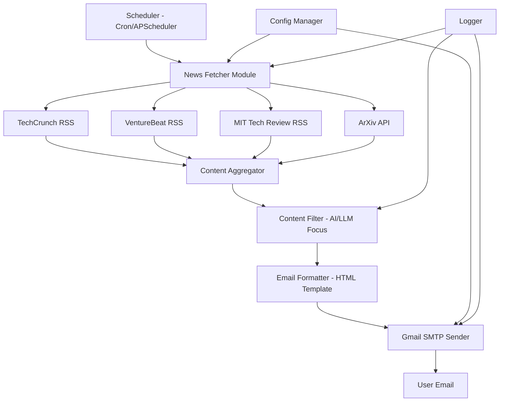

# AI News Agent - Implementation Plan

## Project Overview
Build an automated AI news agent that fetches the latest AI news from trusted sources daily and sends a curated email digest at 8 AM IST, focusing on LLMs and general AI breakthroughs.

## Requirements Summary
- **Frequency**: Daily at 8 AM IST
- **Sources**: TechCrunch, VentureBeat, MIT Technology Review, ArXiv
- **Email Service**: Gmail SMTP
- **Deployment**: Local machine with cron/scheduler
- **Focus Areas**: LLMs and general AI breakthroughs

## System Architecture



## Technical Stack
- **Language**: Python 3.9+
- **Key Libraries**:
  - `feedparser` - RSS feed parsing
  - `requests` - HTTP requests for APIs
  - `beautifulsoup4` - Web scraping if needed
  - `smtplib` - Gmail SMTP integration
  - `email` - Email formatting
  - `apscheduler` - Job scheduling
  - `python-dotenv` - Environment variable management
  - `openai` or `anthropic` - Optional: AI-powered content filtering

## Project Structure
```
ai-news-agent/
├── src/
│   ├── __init__.py
│   ├── config.py              # Configuration management
│   ├── fetchers/
│   │   ├── __init__.py
│   │   ├── base_fetcher.py    # Abstract base class
│   │   ├── rss_fetcher.py     # RSS feed fetcher
│   │   ├── arxiv_fetcher.py   # ArXiv API fetcher
│   │   └── sources.py         # Source configurations
│   ├── filters/
│   │   ├── __init__.py
│   │   ├── keyword_filter.py  # Keyword-based filtering
│   │   └── ai_filter.py       # Optional: AI-powered filtering
│   ├── formatters/
│   │   ├── __init__.py
│   │   ├── email_formatter.py # HTML email template
│   │   └── templates/
│   │       └── digest.html    # Email template
│   ├── sender/
│   │   ├── __init__.py
│   │   └── gmail_sender.py    # Gmail SMTP implementation
│   └── scheduler/
│       ├── __init__.py
│       └── job_scheduler.py   # Scheduling logic
├── tests/
│   ├── __init__.py
│   ├── test_fetchers.py
│   ├── test_filters.py
│   └── test_sender.py
├── logs/                      # Log files directory
├── .env.example              # Example environment variables
├── .env                      # Actual credentials (gitignored)
├── .gitignore
├── requirements.txt
├── setup.py
├── README.md
└── main.py                   # Entry point
```

## Implementation Details

### 1. News Sources Configuration

**TechCrunch AI**
- RSS Feed: `https://techcrunch.com/category/artificial-intelligence/feed/`
- Method: RSS parsing

**VentureBeat AI**
- RSS Feed: `https://venturebeat.com/category/ai/feed/`
- Method: RSS parsing

**MIT Technology Review AI**
- RSS Feed: `https://www.technologyreview.com/topic/artificial-intelligence/feed`
- Method: RSS parsing

**ArXiv AI Papers**
- API: `http://export.arxiv.org/api/query`
- Categories: cs.AI, cs.CL, cs.LG
- Method: ArXiv API with query parameters

### 2. Content Filtering Strategy

**Keyword-based Filtering**:
- Primary keywords: LLM, large language model, GPT, transformer, neural network, deep learning
- Secondary keywords: AI breakthrough, artificial intelligence, machine learning, generative AI
- Exclusion keywords: cryptocurrency, blockchain (unless AI-related)

**Scoring System**:
- Title match: +3 points
- Description match: +2 points
- Multiple keyword matches: +1 point per additional match
- Minimum threshold: 3 points to include

### 3. Email Template Design

**Structure**:
- Header with date and branding
- Summary section with article count
- Categorized sections:
  - Top Stories (highest scored)
  - LLM & Language Models
  - Research Papers (ArXiv)
  - Industry News
- Each article includes:
  - Title (linked)
  - Source and publication date
  - Brief summary/excerpt
  - Relevance score indicator
- Footer with unsubscribe/settings info

### 4. Gmail SMTP Configuration

**Requirements**:
- Gmail account with App Password enabled
- SMTP server: `smtp.gmail.com`
- Port: 587 (TLS)
- Authentication: Username/password

**Environment Variables**:
```
GMAIL_USER=your-email@gmail.com
GMAIL_APP_PASSWORD=your-app-password
RECIPIENT_EMAIL=recipient@example.com
```

### 5. Scheduling Implementation

**Option 1: APScheduler (Recommended for development)**
```python
from apscheduler.schedulers.blocking import BlockingScheduler
from apscheduler.triggers.cron import CronTrigger

scheduler = BlockingScheduler()
scheduler.add_job(
    send_daily_digest,
    CronTrigger(hour=8, minute=0, timezone='Asia/Kolkata')
)
```

**Option 2: System Cron (Recommended for production)**
```bash
# Crontab entry for 8 AM IST daily
0 8 * * * cd /path/to/ai-news-agent && /path/to/python main.py
```

### 6. Error Handling & Logging

**Logging Strategy**:
- Separate log files for each component
- Rotation: Daily with 30-day retention
- Levels: DEBUG for development, INFO for production
- Critical errors trigger email notifications

**Error Handling**:
- Retry mechanism for failed API calls (3 attempts with exponential backoff)
- Graceful degradation if one source fails
- Fallback to cached content if all sources fail
- Email notification for critical failures

## Configuration Management

**`.env` file structure**:
```
# Email Configuration
GMAIL_USER=your-email@gmail.com
GMAIL_APP_PASSWORD=your-16-char-app-password
RECIPIENT_EMAIL=recipient@example.com

# Scheduling
SCHEDULE_TIME=08:00
TIMEZONE=Asia/Kolkata

# Content Filtering
MIN_RELEVANCE_SCORE=3
MAX_ARTICLES_PER_DIGEST=20

# Logging
LOG_LEVEL=INFO
LOG_RETENTION_DAYS=30

# Optional: AI-powered filtering
OPENAI_API_KEY=your-openai-key (optional)
```

## Testing Strategy

1. **Unit Tests**: Test individual components (fetchers, filters, formatters)
2. **Integration Tests**: Test end-to-end workflow
3. **Manual Testing**: Send test emails before production
4. **Dry Run Mode**: Preview digest without sending email

## Deployment Steps

1. Clone repository and set up virtual environment
2. Install dependencies: `pip install -r requirements.txt`
3. Configure `.env` file with credentials
4. Test manually: `python main.py --test`
5. Set up cron job or run scheduler
6. Monitor logs for first few days

## Future Enhancements

- Web dashboard for managing preferences
- Multiple recipient support
- Custom keyword configuration via UI
- AI-powered summarization of articles
- Mobile app notifications
- Integration with Slack/Discord
- Sentiment analysis of AI news trends
- Historical archive and search functionality

## Security Considerations

- Store credentials in `.env` file (never commit to git)
- Use Gmail App Passwords instead of account password
- Implement rate limiting for API calls
- Sanitize HTML content to prevent XSS
- Regular dependency updates for security patches

## Estimated Timeline

- Setup & Configuration: 1 hour
- Core Implementation: 4-6 hours
- Testing & Refinement: 2-3 hours
- Documentation: 1 hour
- **Total**: 8-11 hours

## Success Metrics

- Daily email delivery rate: >99%
- Average article relevance score: >4/5
- Email open rate tracking (optional)
- Zero critical errors per week
- User satisfaction with content quality