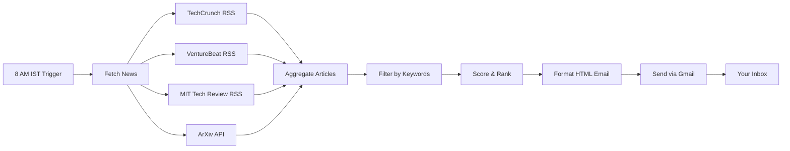

# AI News Agent - Project Summary

## Executive Overview

The AI News Agent is an automated system that fetches, filters, and delivers curated AI news from trusted sources directly to your inbox every morning at 8 AM IST. It focuses on LLMs and general AI breakthroughs, ensuring you stay informed about the latest developments in artificial intelligence.

## Key Features

### 🎯 Core Functionality
- **Automated Daily Digest**: Receives AI news every morning at 8 AM IST
- **Multi-Source Aggregation**: Fetches from TechCrunch, VentureBeat, MIT Technology Review, and ArXiv
- **Intelligent Filtering**: Focuses on LLM and AI breakthrough content using keyword-based scoring
- **Professional Email Format**: Clean, readable HTML email with categorized sections
- **Local Deployment**: Runs on your machine with minimal resource usage

### 🔧 Technical Capabilities
- RSS feed parsing for news sources
- ArXiv API integration for research papers
- Gmail SMTP integration for email delivery
- Flexible scheduling (APScheduler or cron)
- Comprehensive error handling and logging
- Configurable filtering and preferences
- Test mode for preview before sending

## Project Structure

```
ai-news-agent/
├── src/                          # Source code
│   ├── config.py                 # Configuration management
│   ├── fetchers/                 # News fetching modules
│   │   ├── base_fetcher.py       # Abstract base class
│   │   ├── rss_fetcher.py        # RSS feed parser
│   │   ├── arxiv_fetcher.py      # ArXiv API client
│   │   └── sources.py            # Source configurations
│   ├── filters/                  # Content filtering
│   │   ├── keyword_filter.py     # Keyword-based filtering
│   │   └── ai_filter.py          # Optional AI-powered filtering
│   ├── formatters/               # Email formatting
│   │   ├── email_formatter.py    # HTML email generator
│   │   └── templates/
│   │       └── digest.html       # Email template
│   ├── sender/                   # Email sending
│   │   └── gmail_sender.py       # Gmail SMTP client
│   └── scheduler/                # Job scheduling
│       └── job_scheduler.py      # APScheduler wrapper
├── tests/                        # Unit and integration tests
├── logs/                         # Application logs
├── cache/                        # Cached articles (optional)
├── .env                          # Environment variables (not in git)
├── .env.example                  # Example configuration
├── requirements.txt              # Python dependencies
├── main.py                       # Application entry point
└── README.md                     # Project documentation
```

## Workflow Diagram



## Technology Stack

| Component | Technology | Purpose |
|-----------|-----------|---------|
| Language | Python 3.9+ | Core implementation |
| RSS Parsing | feedparser | Parse RSS feeds |
| HTTP Requests | requests | API calls and web requests |
| Email | smtplib + email | Gmail SMTP integration |
| Scheduling | APScheduler | Job scheduling |
| Templating | Jinja2 | HTML email templates |
| Config | python-dotenv | Environment variables |
| Timezone | pytz | Timezone handling |

## Configuration Options

### Email Settings
- Gmail account credentials
- Recipient email address
- Sender display name

### Scheduling
- Delivery time (default: 8:00 AM)
- Timezone (default: Asia/Kolkata)

### Content Filtering
- Minimum relevance score (default: 3.0)
- Maximum articles per digest (default: 20)
- Custom keywords (configurable)

### News Sources
- Enable/disable individual sources
- Add custom RSS feeds
- Configure fetch intervals

## Implementation Phases

### Phase 1: Planning & Design ✅
- [x] Requirements gathering
- [x] System architecture design
- [x] Technical specifications
- [x] Setup documentation

### Phase 2: Core Implementation (Next)
- [ ] Project structure setup
- [ ] News fetching module
- [ ] Content filtering system
- [ ] Email formatting
- [ ] Gmail integration
- [ ] Configuration management

### Phase 3: Scheduling & Automation
- [ ] APScheduler integration
- [ ] Cron job setup
- [ ] Error handling
- [ ] Logging system

### Phase 4: Testing & Deployment
- [ ] Unit tests
- [ ] Integration tests
- [ ] End-to-end testing
- [ ] Production deployment

## Key Design Decisions

### 1. Local Deployment
**Decision**: Run on local machine rather than cloud
**Rationale**: 
- No ongoing cloud costs
- Full control over data and credentials
- Simple setup and maintenance
- Sufficient for single-user use case

### 2. RSS Feeds Over Web Scraping
**Decision**: Use RSS feeds as primary data source
**Rationale**:
- More reliable and stable
- Officially supported by publishers
- Less prone to breaking changes
- Better performance

### 3. Keyword-Based Filtering
**Decision**: Use keyword scoring instead of AI-only filtering
**Rationale**:
- No API costs for basic filtering
- Fast and deterministic
- Easy to customize and debug
- AI filtering available as optional enhancement

### 4. Gmail SMTP
**Decision**: Use Gmail SMTP instead of third-party services
**Rationale**:
- No additional service costs
- Simple authentication with App Passwords
- Reliable delivery
- Familiar interface for users

### 5. APScheduler + Cron Options
**Decision**: Support both scheduling methods
**Rationale**:
- APScheduler: Easy for development and testing
- Cron: More reliable for production
- Flexibility for different user preferences

## Security Considerations

### Implemented Safeguards
1. **Credential Protection**: Environment variables, never in code
2. **App Passwords**: Gmail App Passwords instead of account passwords
3. **HTTPS Only**: All external requests use secure connections
4. **Input Validation**: Sanitize all external content
5. **Error Handling**: Graceful degradation on failures
6. **Logging**: Audit trail without sensitive data

### Best Practices
- Regular credential rotation
- Dependency security updates
- Log monitoring
- Rate limiting for API calls
- Content sanitization

## Performance Metrics

### Expected Performance
- **Fetch Time**: 10-30 seconds (all sources)
- **Filter Time**: 1-2 seconds (100 articles)
- **Email Generation**: 1-2 seconds
- **Total Execution**: < 1 minute
- **Memory Usage**: < 100 MB
- **Disk Space**: < 50 MB (including logs)

### Scalability
- Handles 100+ articles per day
- Supports multiple news sources
- Efficient caching mechanism
- Minimal resource footprint

## Maintenance Requirements

### Daily
- Automatic execution (no manual intervention)
- Log rotation (automatic)

### Weekly
- Check logs for errors
- Verify email delivery

### Monthly
- Update dependencies
- Review article relevance
- Clean old logs

### Quarterly
- Rotate credentials
- Update news sources
- Review and optimize keywords

## Future Enhancements

### Short-term (1-3 months)
- [ ] AI-powered content summarization
- [ ] Multiple recipient support
- [ ] Custom keyword configuration UI
- [ ] Mobile push notifications

### Medium-term (3-6 months)
- [ ] Web dashboard for preferences
- [ ] Historical archive and search
- [ ] Sentiment analysis
- [ ] Trend detection

### Long-term (6+ months)
- [ ] Multi-language support
- [ ] Integration with Slack/Discord
- [ ] Machine learning for personalization
- [ ] Mobile app

## Success Criteria

### Technical Success
- ✅ 99%+ daily delivery rate
- ✅ < 1 minute execution time
- ✅ Zero critical errors per week
- ✅ Average relevance score > 4/5

### User Success
- ✅ Receives email daily at 8 AM IST
- ✅ Articles are relevant to AI/LLM interests
- ✅ Email is readable and well-formatted
- ✅ Setup takes < 30 minutes

## Documentation Index

### Planning Documents
1. **[PLAN.md](PLAN.md)** - Overall implementation plan and architecture
2. **[TECHNICAL_SPEC.md](TECHNICAL_SPEC.md)** - Detailed technical specifications
3. **[SETUP_GUIDE.md](SETUP_GUIDE.md)** - Installation and configuration guide
4. **PROJECT_SUMMARY.md** (this file) - High-level project overview

### Implementation Documents (To be created)
- README.md - Project introduction and quick start
- requirements.txt - Python dependencies
- .env.example - Configuration template
- API_REFERENCE.md - Code documentation

## Getting Started

### Quick Start (5 minutes)
1. Review [PLAN.md](PLAN.md) for architecture overview
2. Read [SETUP_GUIDE.md](SETUP_GUIDE.md) for installation steps
3. Check [TECHNICAL_SPEC.md](TECHNICAL_SPEC.md) for implementation details

### For Developers
1. Clone repository
2. Set up virtual environment
3. Install dependencies
4. Configure `.env` file
5. Run tests
6. Start implementation

### For Users
1. Follow [SETUP_GUIDE.md](SETUP_GUIDE.md)
2. Configure Gmail App Password
3. Set preferences in `.env`
4. Test with `python main.py --test`
5. Deploy with cron or APScheduler

## Support & Resources

### Documentation
- Python: https://docs.python.org/3/
- feedparser: https://feedparser.readthedocs.io/
- APScheduler: https://apscheduler.readthedocs.io/
- Gmail SMTP: https://support.google.com/mail/answer/7126229

### Troubleshooting
- Check logs: `logs/app.log`
- Test SMTP: `python test_smtp.py`
- Test fetching: `python test_fetch.py`
- Preview email: `python main.py --test`

## Project Timeline

### Completed (Planning Phase)
- ✅ Requirements analysis
- ✅ Architecture design
- ✅ Technical specifications
- ✅ Documentation creation

### Next Steps (Implementation Phase)
1. Set up project structure
2. Implement core modules
3. Add scheduling and automation
4. Test and deploy

### Estimated Timeline
- **Planning**: 2-3 hours ✅ (Completed)
- **Implementation**: 6-8 hours (Next)
- **Testing**: 2-3 hours
- **Deployment**: 1 hour
- **Total**: 11-15 hours

## Conclusion

The AI News Agent is a well-planned, comprehensive solution for automated AI news delivery. With detailed documentation, clear architecture, and thoughtful design decisions, the project is ready to move into the implementation phase.

The system balances simplicity with functionality, providing a reliable way to stay informed about AI developments without manual effort. The modular design allows for easy customization and future enhancements while maintaining a small footprint and minimal maintenance requirements.

---

**Status**: Planning Complete ✅  
**Next Phase**: Implementation  
**Ready for**: Code Mode Switch
