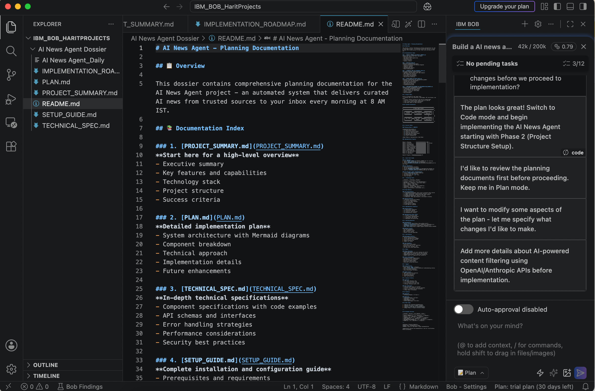
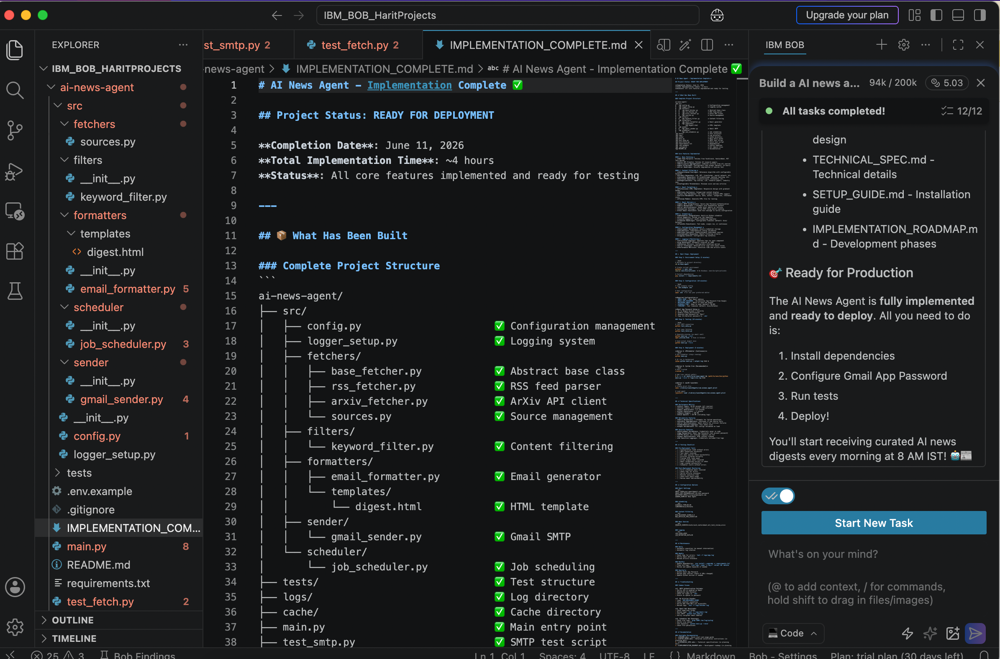
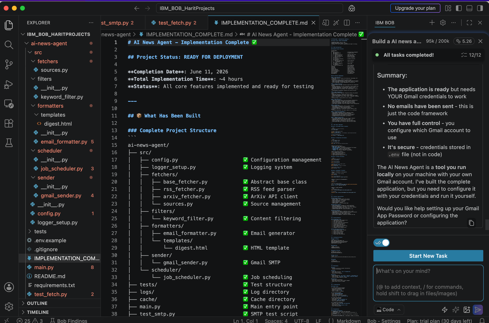
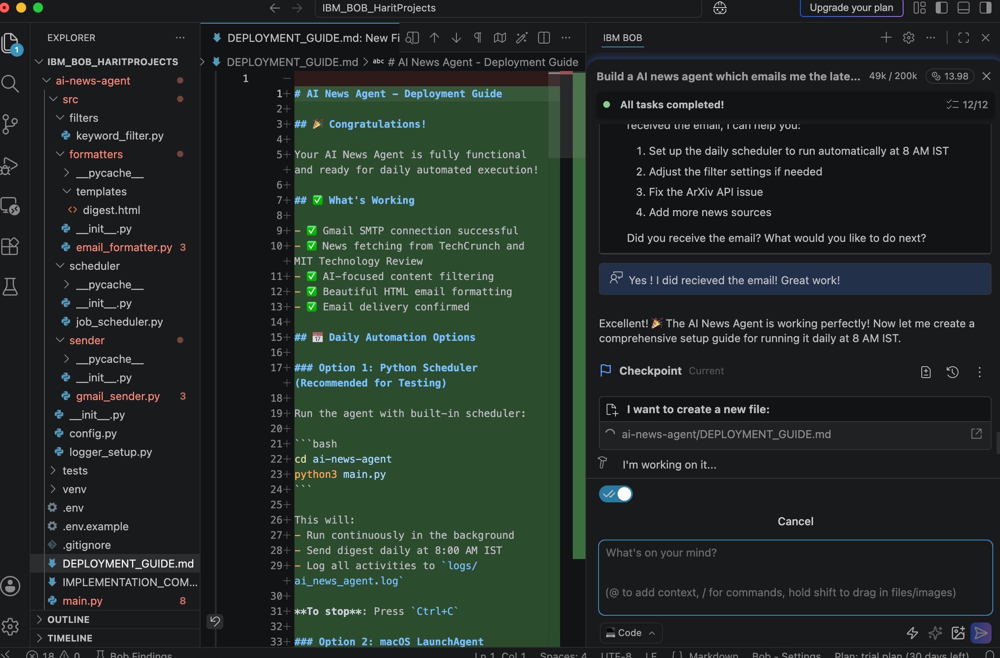

# IBM BOB — AI News Agent Learnings

## Learnings from Building an AI News Agent with IBM BOB

This document captures observations from building an **AI News Agent** using **IBM BOB**. The goal was not only to build a working agent, but also to understand how IBM BOB supports an AI-assisted software development workflow—from planning through implementation, next-best-action guidance, and deployment readiness.

This reflection directly informed the approach to [AI News Agent](../AI-News-Agent/) and shapes my thinking about PM methodology for AI systems.

---

## What I Built

An **AI News Agent** that automates a daily AI news digest workflow:
- Fetches relevant AI/LLM news from trusted sources
- Filters and structures results using keyword-based scoring
- Formats output into professional HTML email
- Supports scheduled delivery (daily at 8 AM IST)

**Project Context:**
- **Tool**: IBM BOB (Low-code AI development platform)
- **Project Type**: AI-assisted software development experiment
- **Build Focus**: News agent / personal automation workflow
- **Learning Lens**: AI product management, agentic workflow design, developer experience, execution handoff

---

## Key Observations

### Observation 1: Clear Planning-to-Code Handoff

**What I noticed:**  
IBM BOB paused after planning and explicitly asked to switch to **Code mode** before implementation started. Most AI tools don't do this intuitively—they jump straight into coding.

**Why this matters:**  
From a product design perspective, this separation is critical because it distinguishes **planning intent** from **execution intent**. It reduces accidental implementation, gives the user a checkpoint to review strategy before code changes, and makes the AI-assisted workflow feel more controlled and intentional.

**PM Takeaway:**  
*Modes are not just UI labels. They productize user intent. A clear transition from planning to coding creates trust and gives the user an explicit approval point before the agent modifies files or infrastructure.*

---

### Observation 2: Structured Architecture & Implementation Documentation

**What I noticed:**
The system generated planning documentation with Mermaid diagrams before any code was written. This made the implementation easier to understand and review before coding started.
IBM BOB Architecture Documentation

**Why this matters:**
AI-assisted development can otherwise become opaque. When the tool creates implementation plans, architecture diagrams, technical specs, and deployment notes upfront, it makes the work inspectable, reviewable, and easier to trust. Users can validate the AI’s reasoning before committing to implementation.

**PM Takeaway:**
For agentic development products, documentation should not be an afterthought. Planning docs, architecture diagrams, and technical specs are part of the product experience because they help the user inspect and trust the agent’s reasoning before implementation.

---

### Observation 3: Well-Structured End-to-End Build Updates

**What I noticed:**  
IBM BOB provided clear updates across different build stages. The completion summary showed:
- Project structure and all implemented components
- Tests and configuration management
- Logging infrastructure
- Scheduling and email integration
- What was complete vs. what needed verification

**Why this matters:**  
This visibility made it easy to understand what had been built, what could be tested, and what remained. Without this, agentic products can feel like black boxes that "just work" without the user understanding the state of the system.

**PM Takeaway:**  
*State visibility is essential in agentic workflows. When an AI agent does multi-step work, users need clear views of progress, completed tasks, remaining gaps, and implementation status. This transparency builds confidence in the tool.*

---

### Observation 4: Accurate Next-Best-Action Guidance

**What I noticed:**  
The AI correctly identified that the application was functionally complete, but the workflow wasn't operationally ready—it needed Gmail credentials to actually send emails. The guidance pointed me to the next constraint, not just the next code task.

**Why this matters:**  
This shows understanding of the difference between "code is complete" and "the workflow is operationally ready." A useful agent doesn't stop at task completion—it identifies the next operational blocker and guides the user toward the next meaningful step.

**PM Takeaway:**  
*A useful agent doesn't just complete tasks. It should identify the next constraint in the workflow and guide the user toward operational readiness. In this case, the blocker wasn't code generation, but configuration and credentials.*

---

### Observation 5: Thoughtful Delivery Completion & Setup Guide

**What I noticed:**  
IBM BOB completed the end-to-end delivery by automatically creating a **Deployment Guide** that included:
- What's working ✅
- Technical review items
- Daily automation options (Python scheduler, LaunchAgent, Cron)
- Steps for running the agent in different modes
- Next steps and troubleshooting

**Why this matters:**  
For AI coding agents, the product experience shouldn't end when code compiles. A stronger experience includes setup guidance, deployment instructions, test steps, operational checks, and clear recommendations for what to do next.

**PM Takeaway:**  
*For AI coding agents, completion is not code generation. It's operational readiness. The product should include setup guidance, deployment instructions, test steps, recovery paths, and clear next actions.*

---

## Broader Product Reflections

IBM BOB's workflow reinforced several key AI PM lessons:

### 1. **Intent Should Be Productized**
Ask, Plan, Code, and similar modes help users express intent without relying only on long prompts. This is a useful design pattern for AI-native products—it makes the interaction feel structured and intentional rather than conversational and opaque.

### 2. **Trust Comes from Checkpoints**
Pausing before implementation, showing plans, and asking for mode changes all create user control points. This is especially important when the AI can modify code or run commands.

### 3. **Agentic Workflows Need State Visibility**
Users need to understand what the agent has done, what it's currently doing, and what still requires human action. This visibility builds confidence.

### 4. **Completion Should Include Operational Readiness**
A project is not truly complete when code is generated. It's complete when the user knows how to configure it, test it, run it, and recover from expected issues.

### 5. **Documentation is Part of the AI Product Experience**
Architecture notes, setup guides, technical specs, and implementation summaries help make AI-generated work reviewable, reusable, and trustworthy.

---

## How This Informed My Approach to AI Product Building

These observations directly shaped the approach I've taken with both projects in this portfolio:

### **AI News Agent**
- ✅ Modular architecture (so each component can be inspected)
- ✅ Comprehensive observability (logging, recovery mechanisms)
- ✅ Detailed setup guides and deployment documentation
- ✅ Clear separation of concerns (testable pieces)

### **Strategic Decision OS**
- ✅ PRD before implementation (planning intent visible)
- ✅ Sequential agent orchestration (not parallel—clear reasoning flow)
- ✅ HITL gates (human checkpoints before execution)
- ✅ Structured outputs with JSON validation (state visibility)
- ✅ Architecture documentation explaining agent sequence

---

## Summary

My biggest learning from using IBM BOB: **AI-assisted development is not primarily about faster code generation.**

The more interesting product pattern is the **structured workflow *around* the model**: planning, context, approval checkpoints, implementation, progress visibility, next-best-action guidance, and deployment readiness.

**For AI PMs**, this is the key insight:

> *The quality of an AI product depends not only on the model capability, but also on how thoughtfully the workflow around the model is designed.*

This document exists to:
1. Practice **reflective documentation** (documenting my own process)
2. Share learnings with others building AI-assisted development tools
3. Demonstrate PM methodology (observing patterns, drawing insights, applying learnings)
4. Show **self-awareness** about how tools and processes shape product thinking

---

## Related Projects

- **[AI News Agent](../AI-News-Agent/)** — The implementation artifact from this learning
- **[Strategic Decision OS](../Decision%20OS%20Agent/)** — Application of sequential agent thinking
- **[Main Portfolio](../README.md)** — Full PM approach to AI product building
